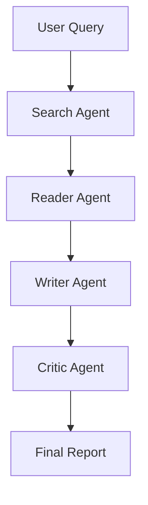

# 🧠 Deep Research Agent

### 🚀 Multi-Agent AI System for Automated Research


---

## 🌟 Overview

**Deep Research Agent** is a **multi-agent AI system** that automates the entire research pipeline—from gathering information to generating structured, high-quality reports.

It mimics how a human researcher works using specialized AI agents:

* 🔍 Search → 📖 Read → ✍️ Write → 🧠 Critique

---

## 🎥 Demo

👉 [

```text
[Watch Demo]
```

---

## 🧠 How It Works



---

## ⚙️ Tech Stack

| Category      | Technology                                 |
| ------------- | ------------------------------------------ |
| Backend       | FastAPI                                    |
| LLM Framework | LangChain (LCEL)                           |
| APIs          | Tavily, Mistral, Google Gemini, OpenRouter |
| Scraping      | BeautifulSoup                              |
| Server        | Uvicorn                                    |
| Frontend      | HTML, CSS, JS                              |

---

## 📸 Screenshots

| 🖥️ UI                                                   | 📊 Output                                                |
| -------------------------------------------------------- | -------------------------------------------------------- |
|  |  |

| 🤖 Agent Flow                                            | 📄 Report                                                |
| -------------------------------------------------------- | -------------------------------------------------------- |
|  |  |

---
 🤖 Architecture                                            |
| -------------------------------------------------------- 
|  

---

## 🚀 Features

* ✅ Multi-agent architecture
* ✅ Real-time web search (Tavily)
* ✅ Intelligent report generation
* ✅ Automated evaluation (Critic Agent)
* ✅ Clean UI with FastAPI
* ✅ Modular and scalable design

---

## 🛠️ Installation & Setup

### 1️⃣ Clone the Repository

```bash
git clone https://github.com/bhautik2005/Deep-Research-Agent.git
cd Deep-Research-Agent
```

---

### 2️⃣ Create Virtual Environment

```bash
python -m venv .venv
.\.venv\Scripts\activate
```

---

### 3️⃣ Install Dependencies

```bash
pip install -r requirements.txt
```

---

### 4️⃣ Environment Variables

Create a `.env` file:

```env
MISTRAL_API_KEY=
GOOGLE_API_KEY=
TAVILY_API_KEY=
OPENWEATHER_API_KEY=
OPENROUTER_API_KEY=
```

---

### 5️⃣ Run the Application

```bash
uvicorn main:app --reload --port 8000
```

---

### 6️⃣ Access the App

```text
http://localhost:8000
```

---

## 📂 Project Structure

```bash
 📂 Deep_Research_Agent
│
├── 📂 App_Screenshot/           # Images/Screenshots of the UI and architecture
│   └── architecture_img.png     # Architecture diagram you just pushed
│
├── 📂 static/                   # Frontend static assets
│   ├── 📂 css/
│   │   └── style.css            # Custom styling for the web interface
│   └── 📂 js/
│       └── app.js               # Frontend logic for the SSE stream and UI updates
│
├── 📂 templates/                # HTML templates
│   └── index.html               # Main user interface for the web app
│
├── agents.py                    # LangChain definitions for Search, Reader, Writer, and Critic agents
├── apitest.py                   # Sandbox/Test script for verifying API connections
├── main.py                      # FastAPI server & Server-Sent Events (SSE) orchestrator
├── pipeline.py                  # CLI version of the agent pipeline for terminal execution
├── tools.py                     # Custom tools (Tavily Search and BeautifulSoup Web Scraper)
│
├── requirements.txt             # Python dependencies (fastapi, langchain, bs4, etc.)
├── run_project.txt              # Quickstart guide and run instructions
├── .env                         # API Keys (OpenRouter, Tavily, etc.) - Ignored by Git
└── .gitignore                   # Git exclusions (ignores .venv, .env, and large videos)

```
 ```mermaid
graph TD

%% USER FLOW
A[User Input - Research Topic] --> B[Frontend UI - index.html + app.js]
B --> C[FastAPI Backend - main.py SSE]

%% CORE PIPELINE
C --> D[Search Agent - Tavily API]
D --> E[Reader Agent - BeautifulSoup Scraper]
E --> F[Writer Chain - LLM + Prompt]
F --> G[Critic Chain - Evaluation]

G --> H[Final Research Report]
H --> I[SSE Stream Response]
I --> B

%% PROJECT FILES
subgraph Project_Structure
    J[agents.py - Agent Logic]
    K[tools.py - Search + Scraper]
    L[pipeline.py - CLI Pipeline]
    M[apitest.py - API Testing]
end

C --> J
D --> K
E --> K
F --> J
G --> J
C --> L
C --> M

%% FRONTEND
subgraph Frontend
    N[index.html]
    O[style.css]
    P[app.js - SSE Handler]
end

B --> N
B --> O
B --> P

%% EXTERNAL APIs
subgraph External_APIs
    Q[Tavily API]
    R[OpenRouter API - LLM]
    S[Google API]
    T[Mistral API]
end

D --> Q
F --> R
F --> S
F --> T

%% ENV
subgraph ENV_Config
    U[MISTRAL_API_KEY]
    V[GOOGLE_API_KEY]
    W[TAVILY_API_KEY]
    X[OPENROUTER_API_KEY]
end

Q --> W
R --> X
S --> V
T --> U

%% OUTPUT
G --> Y[Score and Feedback]
```


---

## 🧪 Example Use Case

**Input:**

```text
Impact of war on stock market
```

**Output:**

* Structured research report
* Key insights
* Sector-wise analysis
* Critic score & feedback

---

## 📈 Future Enhancements

* 🔄 Streaming responses (real-time output)
* 🧠 Memory with vector database (ChromaDB / FAISS)
* 🤖 LangGraph-based agent orchestration
* 📊 Data-driven insights (charts & stats)
* 🔐 Authentication system

---

## 🤝 Contributing

Contributions are welcome!
Feel free to open issues or submit pull requests.

---

## 📜 License

MIT License

---

## 👨‍💻 Author

**Bhautik Gondaliya**
🔗 https://github.com/bhautik2005

---

## ⭐ Support

If you like this project, give it a ⭐ and share it!

---
