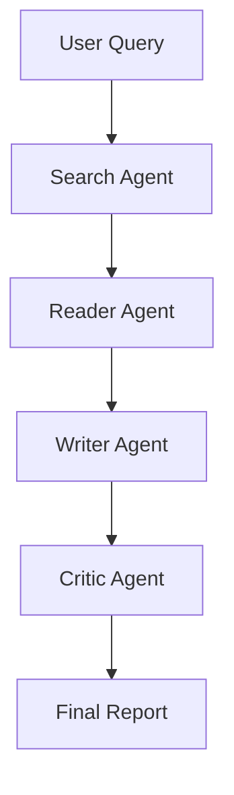

# 🧠 Deep Research Agent

### 🚀 Multi-Agent AI System for Automated Research


---

## 🌟 Overview

**Deep Research Agent** is a **multi-agent AI system** that automates the entire research pipeline—from gathering information to generating structured, high-quality reports.

It mimics how a human researcher works using specialized AI agents:

* 🔍 Search → 📖 Read → ✍️ Write → 🧠 Critique

---

## 🎥 Demo

👉 *(Add your video link here after uploading to Google Drive / YouTube)*

```text
[Watch Demo]
```

---

## 🧠 How It Works



---

## ⚙️ Tech Stack

| Category      | Technology                                 |
| ------------- | ------------------------------------------ |
| Backend       | FastAPI                                    |
| LLM Framework | LangChain (LCEL)                           |
| APIs          | Tavily, Mistral, Google Gemini, OpenRouter |
| Scraping      | BeautifulSoup                              |
| Server        | Uvicorn                                    |
| Frontend      | HTML, CSS, JS                              |

---

## 📸 Screenshots

| 🖥️ UI                                                   | 📊 Output                                                |
| -------------------------------------------------------- | -------------------------------------------------------- |
|  |  |

| 🤖 Agent Flow                                            | 📄 Report                                                |
| -------------------------------------------------------- | -------------------------------------------------------- |
|  |  |

---

## 🚀 Features

* ✅ Multi-agent architecture
* ✅ Real-time web search (Tavily)
* ✅ Intelligent report generation
* ✅ Automated evaluation (Critic Agent)
* ✅ Clean UI with FastAPI
* ✅ Modular and scalable design

---

## 🛠️ Installation & Setup

### 1️⃣ Clone the Repository

```bash
git clone https://github.com/bhautik2005/Deep-Research-Agent.git
cd Deep-Research-Agent
```

---

### 2️⃣ Create Virtual Environment

```bash
python -m venv .venv
.\.venv\Scripts\activate
```

---

### 3️⃣ Install Dependencies

```bash
pip install -r requirements.txt
```

---

### 4️⃣ Environment Variables

Create a `.env` file:

```env
MISTRAL_API_KEY=
GOOGLE_API_KEY=
TAVILY_API_KEY=
OPENWEATHER_API_KEY=
OPENROUTER_API_KEY=
```

---

### 5️⃣ Run the Application

```bash
uvicorn main:app --reload --port 8000
```

---

### 6️⃣ Access the App

```text
http://localhost:8000
```

---

## 📂 Project Structure

```bash
Deep_Research_Agent/
│
├── agents.py
├── tools.py
├── pipeline.py
├── main.py
│
├── templates/
├── static/
│
├── App_Screenshot/
├── requirements.txt
└── .env
```
```mermaid
graph TD

%% =========================
%% USER FLOW
%% =========================
A[👤 User Input<br/>Research Topic] --> B[🌐 Frontend UI<br/>index.html + app.js]

B --> C[⚡ FastAPI Backend<br/>main.py (SSE Streaming)]

%% =========================
%% CORE PIPELINE
%% =========================
C --> D[🔍 Search Agent<br/>Tavily API]
D --> E[📖 Reader Agent<br/>Web Scraper (BeautifulSoup)]
E --> F[✍️ Writer Chain<br/>LLM + Prompt Template]
F --> G[🧠 Critic Chain<br/>Evaluation + Score]

G --> H[📄 Final Research Report]
H --> I[📡 SSE Stream Response]
I --> B

%% =========================
%% FILE STRUCTURE
%% =========================
subgraph 📂 Project Structure
    J[agents.py<br/>Agent Logic]
    K[tools.py<br/>Search + Scraper Tools]
    L[pipeline.py<br/>CLI Pipeline]
    M[apitest.py<br/>API Testing]
end

C --> J
D --> K
E --> K
F --> J
G --> J
C --> L
C --> M

%% =========================
%% FRONTEND
%% =========================
subgraph 🎨 Frontend
    N[index.html]
    O[style.css]
    P[app.js (SSE Handler)]
end

B --> N
B --> O
B --> P

%% =========================
%% EXTERNAL SERVICES
%% =========================
subgraph 🌍 External APIs
    Q[Tavily API]
    R[OpenRouter API<br/>LLM (GPT-4o-mini)]
    S[Google API]
    T[Mistral API]
end

D --> Q
F --> R
F --> S
F --> T

%% =========================
%% ENV CONFIG
%% =========================
subgraph 🔐 Environment (.env)
    U[MISTRAL_API_KEY]
    V[GOOGLE_API_KEY]
    W[TAVILY_API_KEY]
    X[OPENROUTER_API_KEY]
end

Q --> W
R --> X
S --> V
T --> U

%% =========================
%% OUTPUT
%% =========================
G --> Y[⭐ Score + Feedback]
```


---

## 🧪 Example Use Case

**Input:**

```text
Impact of war on stock market
```

**Output:**

* Structured research report
* Key insights
* Sector-wise analysis
* Critic score & feedback

---

## 📈 Future Enhancements

* 🔄 Streaming responses (real-time output)
* 🧠 Memory with vector database (ChromaDB / FAISS)
* 🤖 LangGraph-based agent orchestration
* 📊 Data-driven insights (charts & stats)
* 🔐 Authentication system

---

## ⚠️ Best Practices

* Do NOT commit `.env` file
* Use `.gitignore` properly
* Keep API keys secure
* Use virtual environment

---

## 🤝 Contributing

Contributions are welcome!
Feel free to open issues or submit pull requests.

---

## 📜 License

MIT License

---

## 👨‍💻 Author

**Bhautik Gondaliya**
🔗 https://github.com/bhautik2005

---

## ⭐ Support

If you like this project, give it a ⭐ and share it!

---
